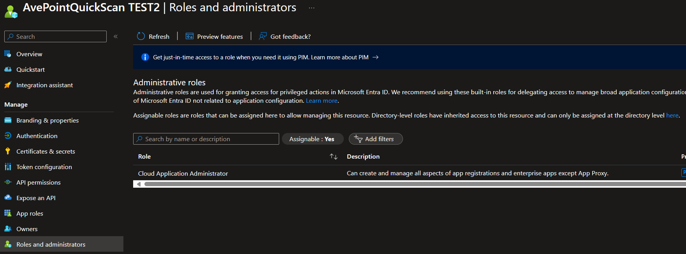
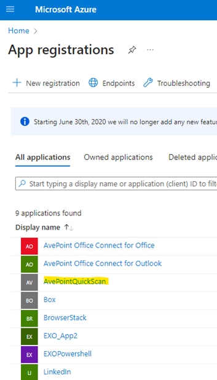

# SharePoint Online QuickScan

The PowerShell script can be used to run on target site collections to create a report for all storage consumed on list or file level. This can be used as an indicator of how much content you have on M365 that can be archived to save storage.

## How To Use

### Enable Auditing (only if you want to scan files with last accessed date)
We must turn ON the audit logs feature in the Compliance Center before you access the audit logs for SharePoint Online. Follow these steps:
1. Log in to the Microsoft Office 365 admin center with Global Administrator permissions: https://admin.microsoft.com
2. Click on the “Show All” link and then “Compliance” under admin Centers in the left navigation.
3. In the Compliance center, click on the “Audit” link in the left navigation >>  Click on the “Start recording user and admin activity” button and give it a minute to complete. In case, you don’t see this link or button, that means auditing is already turned ON.

4. The final step is to make sure that Exchange Online recognizes the automation account which hosts the managed identity as an Exchange administrator. This is done by assigning the Exchange Administrator role to the automation account’s app in the Azure AD admin center.

### Create Azure App

1. Clone or download the files here into your local folder
2. Open PowerShell IDE, as an administrator & navigate to the folder downloaded
3. Open *AzureApp.ps1* file & run it, the file will request Global Admin login to create an Azure App with API permissions required
4. Once the script run is completed successfully, you should have an Azure App *AvePointQuickScan* created & a *appdetails.csv* csv file (see screen shot below)

### Run QuickScan

1. Open PowerShell IDE, as an administrator & navigate to the folder downloaded
2. Open *QuickScan.ps1* file & run it, the file will ask for some paramaters to provide (see table below 

  | Parameter  | Mandatory | Default Value | Description |
  | ------------- | ------------- | ------------- | ------------- |
  | tenantFullName  | yes  | null |  enter your tenant full name (e.g., yourdomain.onmicrosoft.com) |
  | inputFileName  | no | null | enter name of site collections input file or press enter to scan the whole tenant (e.g., input-sitecollections.csv) |
  | reportLevel  | no | null | enter report level needed (allowed values:listLevel or fileLevel)|
  | includeLastAccessed  | no | null | If fileLevel, please enter yes/no to include last accessed files (allowed values:yes or no)|
  | lastModifieddayOrMonthOrYear  | no | day:30 | If fileLevel, please enter day/month/year with number to use for files last modified condition (allowed values:'day:30' or 'month:30' or 'year:10') |
  | lastAccesseddayOrMonthOrYear  | no | day:90 |  If fileLevel, please enter day/month/year with number to use for files last accessed condition (allowed values:'day:90') Audits limited to E3:90 days & E5:365 days maximum|

3. Once the script run is completed successfully, you should have an CSV file created with name *Report_<yyyyMMddhhmmss>_listLevel* or *Report_<yyyyMMddhhmmss>_fileLevel*
   

---

## Sample Input Files

---

## Sample Output Files

---
